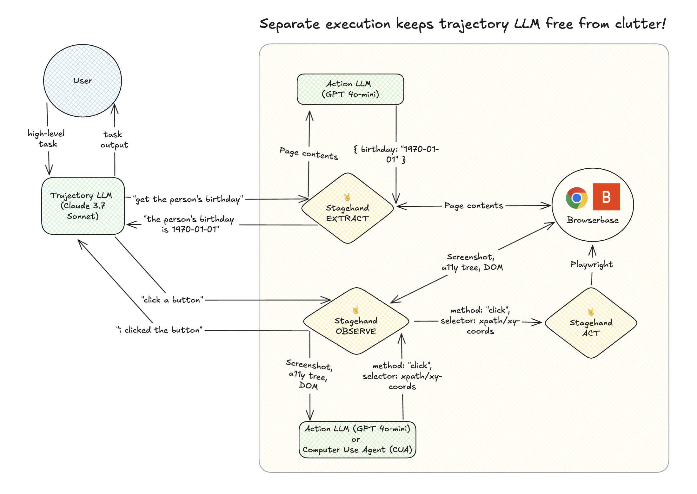

# 🤘 Stagehand Agent

A powerful browser automation agent built with [Stagehand](https://github.com/browserbase/stagehand) that amplifies Playwright with `act`, `extract`, and `observe` capabilities.

## 🚀 Installation

## 🛠️ Usage

You can run the agent without installing anything! Just run the following command:

```bash
npx stagehand-ai
```

## How it works

- `index.ts` is the entry point for the CLI.
- `src/agent.ts` contains the actual agent loop logic.



- Trajectory Model: Claude 3.5 Sonnet
- Action Model: GPT 4o Mini
- Structured Output Model: GPT 4o Mini
- CUA Model: OpenAI Computer Use Preview
